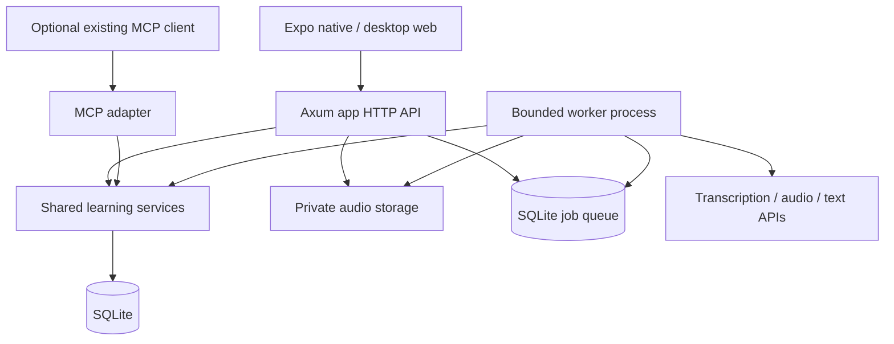

# Backend and API contract

[Handoff index](./README.md) · [Product](./product.md) · [Assessment and delivery](./assessment-and-delivery.md)

## Components



Keep Rust as the coordinator. Implement app routes under `/api/v1`; retain `/mcp` as a separate adapter. Extract reusable request validation from `server.rs` into shared services before exposing equivalent HTTP operations. Use `LearningStore` for existing domain operations; extend it with typed operations rather than spreading SQL or untyped action strings into frontend handlers.

Suggested new modules: `app_api`, `practice_runs`, `media`, `assessment`, `jobs`, and `providers`. Add `src/bin/worker.rs`. Place frontend under `apps/practice/`, with routes in `app/`, and components, media adapters, API client, and generated types outside the route directory. Prefer HTTP polling to SSE initially: every two seconds while processing, backing off to ten seconds, paused while the screen is hidden. Re-fetch when foregrounded.

The worker is a separate process/container so decoding and model requests cannot exhaust the lightweight MCP server. Initially run one job at a time, with configurable decoder memory/CPU/time limits and at most two provider calls concurrently. Keep SQLite transactions short; no transaction or DB lock spans a model request, upload, or audio decode. Use a bounded busy timeout and test concurrent app/MCP writes.

## Authentication and media transport

Reuse Pocket ID identity and the existing allowed-subject policy. Register dedicated native and web OAuth clients/callbacks; do not reuse the ChatGPT callback. Native uses authorization code + PKCE through the system browser and OS-protected token storage. Web uses a server-managed session cookie (`Secure`, `HttpOnly`, `SameSite=Lax`) with server-side token storage, CSRF protection on mutations, and validated OAuth state. Serve the web build and API under one origin initially. Do not expose provider keys or long-lived bearer tokens in the browser bundle.

Native API requests carry a correctly scoped/audienced access token validated by the existing resource-server policy. The web session resolves to the same internal learner identity. Authorize every run, recording, job, feedback, and playback request against that identity. UUIDs are identifiers, not authorization. Never return storage paths or arbitrary fetch-URL inputs.

Use private filesystem media storage on the current single host, behind a small storage interface that can later support object storage. Original recordings are immutable files, outside SQLite. Add a separate volume such as `/data/audio`; keep temp uploads and processed derivatives in distinct directories. The API streams bytes to temporary files and atomically renames after hash/size validation. File and DB operations need reconciliation; they are not one atomic transaction.

For playback, web uses its session cookie. Native either supplies its bearer header if supported by the player or downloads to a private local file through the authenticated client before playing. Use authenticated Range requests for seekable server playback, with `Cache-Control: private, no-store`. Avoid putting bearer tokens in URLs.

App defaults: 25 MiB per uploaded recording, 10–300 seconds decoded duration, bounded channels/sample rate, and no more than three pending assessments per learner. These are app limits, not provider claims. Start with AAC/M4A from native and supported WebM/Opus or MP4 audio from browsers; milestone 0 establishes the actual matrix. Reject unsupported content after decoding/probing, not just MIME inspection. Normalize in the worker to the provider's documented accepted format; preserve the original and timeline mapping. Never buffer full base64 audio in the API process. Apply route-specific reverse-proxy and Axum body/time limits; leave existing MCP limits intact.

## Persistence model

New names below are proposed, not existing tables. Use UUID public IDs, UTC timestamps, foreign keys, and monotonically increasing revisions where mutable. Retain the scheduler's configured learning-day calculation for canonical session dates.

| Entity | Essential fields and invariants |
| --- | --- |
| `practice_runs` | owner, task text, own/generated source, preference snapshot/version, server-only target context, status, revision, created/finished times |
| `recordings` | run, sequence, optional parent recording, immutable original storage key/hash, bytes/codec, client elapsed duration, decoded duration, interruption flag, assistance report, exposure snapshot, upload state |
| `transcript_revisions` | recording, revision, raw text, nullable segment timings, source (`asr`/`learner_edit`), predecessor, author, timestamp; never overwrite raw ASR |
| `assessment_versions` | recording, transcript revision, audio hash, prompt/rubric/model/processor versions, stage results, public feedback, provenance, current/superseded status |
| `feedback_findings` | assessment, category, evidence references, correction/action, status (`active`/`disputed`/`superseded`) |
| `feedback_exposures` | run/recording, assessment version, server time; append-only evidence of shown assistance |
| `assessment_jobs` | recording/version fingerprint, stage, status, attempts, lease owner/expiry, next eligible time, sanitized error code |
| `learning_projections` | unique assessment ID, canonical session ID, input hash, status; supports crash-safe replay |
| `assessment_observation_links` | finding/version to canonical observation IDs; supports provenance, disputes and supersession |
| `usage_events` | owner, job/stage/request IDs, usage units, configured price version, estimated/actual cost, reservation settlement |
| `deletion_jobs` | run or audio scope, generation/tombstone, pending file/derivative cleanup and completion |

Do not put audio URLs or private coaching targets in learner task DTOs. Public serializers must explicitly select fields. Internal raw model outputs may be retained for debugging only with bounded retention/access; routine logs contain IDs, stages, timings, and usage, not audio/transcript contents.

Run status: `ready → active → finished`, with deletion from any state. Recording state: `awaiting_upload → uploaded → processing → ready | partial | failed`; `deleted` is terminal. Local capture state lives on the device until upload. Job state: `queued → running → succeeded | failed | budget_blocked | cancelled`; retryable failures requeue within limits. Assessment result is immutable even when a newer assessment becomes current.

## HTTP endpoints

All endpoints below require app authentication except OAuth callback/session setup. JSON is snake_case. Mutating create/submit requests require `Idempotency-Key`, scoped to owner + route + canonical request hash: same key/body replays; different body returns 409. Updates require `expected_revision` or `If-Match`. Lists use bounded opaque cursors, default 20, maximum 50. Common errors use `{ "error": { "code": "…", "message": "…", "retryable": false }, "request_id": "…" }` without internal exception details.

| Endpoint | Request / result |
| --- | --- |
| `POST /practice-runs` | `{source: "own_topic", topic?: string}` creates a ready run (201). `{source: "generated", duration_seconds: 90}` creates a run with a preparation job (202); no recording until task validation succeeds. |
| `GET /practice-runs/:id` | Public task, run revision/status, recording summaries, preparation job if any; never hidden targets |
| `GET /practice-runs?cursor=…` | History including pending/failed runs and grouped attempts |
| `POST /practice-runs/:id/recordings` | Allocate an upload ID with sequence, parent, MIME, bytes, SHA-256, capture metadata, assistance report; enforce one original + one retry in v1 |
| `PUT /recordings/:id/audio` | Stream original bytes with Content-Type and hash; 201 on first verified receipt, 200 on identical replay, 409 on different bytes. Interrupted writes are discarded; retry the whole small file. |
| `POST /recordings/:id/assessments` | Queue assessment of uploaded immutable audio + current transcript revision (202); return job and assessment IDs. Optional explicit reassess reason. |
| `GET /jobs/:id` | Stage/status, nullable progress details, sanitized failure and available retry action |
| `POST /jobs/:id/retry` | Requeue failed/budget-blocked stage when eligible; reuse successful stage outputs |
| `GET /recordings/:id` | Artifact metadata, transcript revisions, current assessment status and feedback; feedback exposure rules below |
| `GET /recordings/:id/audio` | Authorized playback/download with Range support; 410 when removed |
| `POST /assessments/:id/exposures` | Record exposure and return public feedback payload; the ordinary recording GET must not return hidden feedback before exposure |
| `POST /recordings/:id/transcript-revisions` | `{expected_revision, text, reason}` creates learner revision (201), invalidates current assessment for progress use, and offers explicit reassessment |
| `POST /findings/:id/disputes` | Mark disputed with optional reason; exclude linked evidence from active progress/priority summaries pending reassessment |
| `POST /practice-runs/:id/finish` | Close run (200); recording/analysis survives navigation without finish; unfinished runs remain resumable |
| `GET /practice-runs/:id/comparison` | Derived comparison of current baseline/retry assessment IDs; pending/partial state if not ready |
| `DELETE /practice-runs/:id/audio` | Tombstone audio and queue file/derivative deletion (202); keep text history |
| `DELETE /practice-runs/:id` | Delete run and associated learning evidence under deletion policy (202) |
| `GET/PATCH /app-preferences` | Explanation language, retention, monthly cap; revision-checked writes |
| `GET /usage` | Current month's estimate/settled total, cap, outstanding reservations |

Paths in the table are relative to `/api/v1`. A preparation job needs a general `job_kind` (`prepare_task`/`assess_recording`) and nullable recording reference. A generated-topic failure may be retried or replaced with a new own-topic run. Creating a new generated topic must not mutate an existing task once a recording is allocated.

For offline capture, the client creates a stable local UUID and saves the task snapshot, metadata, audio, and pending operations together. When reconnected, it creates the run/recording in order using those stable IDs as idempotency keys. Existing online task IDs are reused. An offline own-topic run has no hidden targets; subsequent processing must not invent a prior planned target.

Example submission metadata (illustrative identifiers):

```json
{
  "sequence": 1,
  "parent_recording_id": null,
  "mime_type": "audio/mp4",
  "byte_length": 842120,
  "sha256": "<64 lowercase hex characters>",
  "capture": {
    "started_at": "2026-09-07T17:00:00Z",
    "elapsed_ms": 90124,
    "interrupted": false
  },
  "assistance_report": "none_reported"
}
```

Client timings and self-reported assistance are evidence with provenance, not trusted proof of independent cognition. The server derives parent/exposure relationships, verifies run ownership, and validates sequence transitions.

## Durable processing and exactly-once effects

Submission commits job + usage reservation in one SQLite transaction. A worker claims a lease atomically; heartbeats and lease expiry enable restart recovery. Every stage output has a unique recording/hash/transcript/prompt/model fingerprint. Persist successful stage results before advancing. Retry transport failures and provider 429/5xx with jitter/backoff up to three attempts per stage; respect Retry-After. A timeout after provider acceptance can incur duplicate provider cost: local deduplication cannot guarantee provider-side exactly-once execution. Account for that uncertainty and do not retry indefinitely.

Suggested stage timeout is 120 seconds, configurable after measurement. Polling reports long-running status honestly. Provider failure must not hold a request open or lose an uploaded file. Cancellation and deletion set a generation/tombstone checked before each provider call and before committing results; a late response may settle usage but cannot resurrect deleted evidence.

Fingerprint deduplication prevents duplicate internal analysis on double taps. Canonical history publication uses a stable `voice-assessment:<id>` idempotency key and the same canonical payload on every retry. If the process dies after `record_practice` commits but before the link is saved, replay returns the original session, then saves the link. No model receives database-write tools; Rust constructs and validates the projection.

## Integrating existing learning history

For v1, project each assessed recording as one canonical session, grouping original/retry through the new run relationship. Use `exercise_type_key: guided_conversation`, `activity_type: voice_diary` (or the selected supported situational activity), `response_mode: spoken_transcript`, the immutable transcript snapshot, and measured timing with the existing timing-source enum. Validate activity/exercise compatibility through existing services before writing. Keep audio measurements and detailed findings in side tables, linked to attempts/observations. An empty/unusable transcript may remain an app recording without a canonical projection; do not fake speech to satisfy validation.

Create canonical observations only for supported mappings to existing weakness/concept keys. Unmapped feedback remains useful in the app and does not create a new weakness automatically. Persist positive evidence too. V1 passes **no scheduler review proposals**: this is explicit conservative product policy while the assessment is being validated. The existing review scheduler continues to operate for other clients.

Reassessment does not overwrite historical sessions or reuse an old idempotency key with a new payload. Create a new version/projection; atomically mark the old projection superseded and update the current pointer. All active app and MCP progress/priority queries must filter superseded/disputed app evidence, while audit views retain it. Inspect and update weakness summary aggregation too: adding a UI flag alone is insufficient. Projection publication and visibility changes need a shared transactional service, with a recoverable outbox if the existing API cannot commit them together. Do not ship reassessment until this invariant is tested.

Deletion of a whole app run removes its canonical projections and recomputes affected derived weakness summaries from retained evidence; preserve unrelated sessions, concepts and reviews. Because v1 app runs emit no FSRS reviews, no scheduler history needs reversal. If later versions allow app reviews, design explicit scheduler replay/retraction before exposing deletion of reviewed evidence.

## Retention, deployment and cost

Default original/derivative audio retention: 90 days, adjustable to 30 days or keep until deleted. Retain transcript and feedback until run deletion. Expiry removes local server copies and playback availability; it does not imply immediate removal from provider retention or encrypted backups. Document actual provider handling and backup expiry before launch. Client cached copies are removed on next sync when deletion/expiry is observed; unsynced drafts are not purged silently.

Run a sweeper for abandoned uploads older than 24 hours, expired worker artifacts, missing-file reconciliation, and tombstoned media. Back up SQLite and referenced immutable files consistently (snapshot/manifest and delayed garbage collection), encrypt backups, and test restore. Media decoding runs with no network, bounded resources, sanitized generated paths, and no shell interpolation of uploaded filenames.

Deploy API, worker and media volume through the existing deployment configuration. Measure and set independent worker resources before enabling audio; do not inherit the MCP container's memory cap. Use an additive numbered migration against a verified snapshot and the repository's production migration procedure. Release via `scripts/release.sh` when implementation is complete and deployment is authorized.

The first-run settings require a monthly API budget before paid processing is enabled; no numeric spending authorization is inferred by this design. Store cap and reservations in integer currency subunits with a configured price version. Atomically reserve a conservative upper estimate before starting a job, settle actual usage when known, and release unused reservation. Enforce input/output/retry bounds so cost is bounded; block additional calls if price configuration is missing or remaining budget cannot cover the stage. Existing recordings remain playable. Use provider/account billing limits as an additional control, since unknown post-timeout charges can make application totals approximate.
